# 核心概念索引 - 《我对价值投资的思考》

## 概念统计

- **核心概念**：8 个
- **重要概念**：25 个
- **辅助概念**：30+ 个

---

## 核心概念列表

### 核心概念（⭐⭐⭐）

#### 价值投资 (Value Investing)

- **定义**：通过认真分析企业内在价值，以低于价值的价格买入并长期持有的投资策略
- **首次出现**：第 1 章《为什么我要写这本书？》
- **相关概念**：安全边际、内在价值、投机
- **重要性**：⭐⭐⭐
- **书中核心定义**：格雷厄姆定义——"通过认真分析，有指望保本并能获得满意收益的行为；不满足这些条件的行为就叫投机"

#### 安全边际 (Margin of Safety)

- **定义**：购买价格远低于内在价值的缓冲空间，抵御错误的防火墙
- **首次出现**：第 2 章《理解投资和投机的区别》
- **相关概念**：内在价值、本金永久性损失
- **重要性**：⭐⭐⭐
- **经典比喻**：架设桥梁时，载重量为 3 万磅，但你只驾驶 1 万磅的卡车穿梭其间

#### 内在价值 (Intrinsic Value)

- **定义**：企业未来所有自由现金流的折现值
- **首次出现**：第 2 章《理解投资和投机的区别》
- **相关概念**：安全边际、自由现金流、DCF 估值
- **重要性**：⭐⭐⭐
- **巴菲特定义**：在其余的寿命中所能产生的现金流折现后的现值

#### 能力圈 (Circle of Competence)

- **定义**：投资者能够准确评估其未来现金流的行业和企业的范围
- **首次出现**：第 5 章《我的投资原则》
- **相关概念**：认知边界、深入研究
- **重要性**：⭐⭐⭐
- **核心观点**：清楚边界比范围大小更重要

#### 复利 (Compound Interest)

- **定义**：财富积累的根本动力，公式为：财富 = 本金×(1+ 收益率)^时间
- **首次出现**：第 10 章《理解复利的力量——慢即是快》
- **相关概念**：长期持有、本金积累
- **重要性**：⭐⭐⭐
- **世界第八大奇迹**：金钱拥有强大的繁殖能力，钱能生钱子，钱子能生更多的钱孙

#### 护城河 (Moat)

- **定义**：企业可持续的竞争优势，包括品牌、特许经营权、网络效应等
- **首次出现**：第 5 章《我的投资原则》
- **相关概念**：竞争优势、商业模式
- **重要性**：⭐⭐⭐
- **六大类型**：品牌优势、特许经营权、规模优势、网络效应、高转换成本、技术专利

#### 市场先生 (Mr. Market)

- **定义**：格雷厄姆提出的拟人化角色，比喻影响证券价格的客观力量
- **首次出现**：第 3 章《价值投资的有效性》
- **相关概念**：市场波动、逆向投资
- **重要性**：⭐⭐⭐
- **核心寓意**：市场是服务于我们的工具，而非指引我们的主人

#### 长期持有 (Long-term Holding)

- **定义**：基于深入研究以年为单位持有优质企业的策略
- **首次出现**：第 16 章《长期持有策略》
- **相关概念**：复利、集中投资、肥尾效应
- **重要性**：⭐⭐⭐
- **巴菲特名言**：如果你不打算持有一只股票 10 年，那就不要持有它 10 分钟

---

## 重要概念列表（⭐⭐）

### 投资基础

#### 投机 (Speculation)
- **定义**：不基于深入分析，依赖市场情绪或博傻理论进行的交易行为
- **首次出现**：第 2 章《理解投资和投机的区别》
- **重要性**：⭐⭐

#### 股权思维 (Ownership Thinking)
- **定义**：将股票视为企业部分所有权的思维方式
- **首次出现**：第 4 章《我对财富的认识》
- **重要性**：⭐⭐

#### 本金永久性损失 (Permanent Loss of Capital)
- **定义**：投资者投入的资本因错误决策而彻底无法回收
- **首次出现**：第 13 章《理解投资的风险》
- **重要性**：⭐⭐

### 估值方法

#### 自由现金流 (Free Cash Flow, FCF)
- **定义**：企业在维持必要资本开支后可分配给股东的现金流
- **首次出现**：第 5 章《我的投资原则》
- **重要性**：⭐⭐

#### DCF 模型 (Discounted Cash Flow)
- **定义**：现金流折现模型，用于计算企业内在价值
- **首次出现**：第 5 章《我的投资原则》
- **重要性**：⭐⭐

#### 机会成本 (Opportunity Cost)
- **定义**：选择某项投资而放弃的其他最佳替代选择的收益
- **首次出现**：第 5 章《我的投资原则》
- **重要性**：⭐⭐

### 风险管理

#### 价格风险 (Price Risk)
- **定义**：以过高价格买入导致的投资失败风险
- **首次出现**：第 13 章《理解投资的风险》
- **重要性**：⭐⭐

#### 结构性风险 (Structural Risk)
- **定义**：过度使用杠杆导致的被迫平仓风险
- **首次出现**：第 13 章《理解投资的风险》
- **重要性**：⭐⭐

#### 认知风险 (Cognitive Risk)
- **定义**：心理偏差和从众行为导致的错误判断
- **首次出现**：第 13 章《理解投资的风险》
- **重要性**：⭐⭐

#### 护城河坍塌 (Moat Collapse)
- **定义**：企业竞争优势因竞争加剧或技术变革而瓦解
- **首次出现**：第 13 章《理解投资的风险》
- **重要性**：⭐⭐

### 心理认知

#### 损失厌恶 (Loss Aversion)
- **定义**：人们对亏损的痛苦感受是同等收益快乐感的 2 倍以上
- **首次出现**：第 8 章《投资心理学》
- **重要性**：⭐⭐

#### 锚定效应 (Anchoring Effect)
- **定义**：做决策时过度依赖第一眼看到的数字作为参考点
- **首次出现**：第 8 章《投资心理学》
- **重要性**：⭐⭐

#### 心理账户 (Mental Accounting)
- **定义**：将不同来源和用途的资金放入不同"心理抽屉"的处理方式
- **首次出现**：第 8 章《投资心理学》
- **重要性**：⭐⭐

#### 确认偏差 (Confirmation Bias)
- **定义**：寻找和支持已有观点的信息，忽视反面证据
- **首次出现**：第 8 章《投资心理学》
- **重要性**：⭐⭐

#### 从众效应 (Herd Behavior)
- **定义**：受群体影响而放弃独立判断跟随大众行为
- **首次出现**：第 8 章《投资心理学》
- **重要性**：⭐⭐

#### 过度自信 (Overconfidence Effect)
- **定义**：高估自己分析和预测能力的倾向
- **首次出现**：第 8 章《投资心理学》
- **重要性**：⭐⭐

#### 短视心理 (Myopic Vision)
- **定义**：过分强调短期表现而忽视长期价值
- **首次出现**：第 8 章《投资心理学》
- **重要性**：⭐⭐

### 投资策略

#### 集中投资 (Concentrated Investing)
- **定义**：将主要资金集中于少数深度理解的高确定性标的
- **首次出现**：第 6 章《我的投资组合》
- **重要性**：⭐⭐

#### 逆向投资 (Contrarian Investing)
- **定义**：在市场情绪极端时采取与大众相反的操作
- **首次出现**：第 15 章《逆向投资策略》
- **重要性**：⭐⭐

#### 资产配置 (Asset Allocation)
- **定义**：在现金、债券、股票、不动产等资产类别间分配资金
- **首次出现**：第 6 章《我的投资组合》
- **重要性**：⭐⭐

### 市场理解

#### 市场周期 (Market Cycle)
- **定义**：市场在乐观与悲观间摆动的周期性现象
- **首次出现**：第 11 章《理解市场和行业的周期性》
- **重要性**：⭐⭐

#### 行业周期 (Industry Cycle)
- **定义**：行业供需关系变化的周期性规律
- **首次出现**：第 11 章《理解市场和行业的周期性》
- **重要性**：⭐⭐

#### 肥尾效应 (Fat Tails)
- **定义**：回报高度集中在少数关键时刻的现象
- **首次出现**：第 16 章《长期持有策略》
- **重要性**：⭐⭐

---

## 辅助概念列表（⭐）

| 概念名称 | 简要说明 | 首次出现 |
|---------|---------|---------|
| 捡烟蒂理论 | 寻找价格低于清算价值的公司股票 | 第 3 章 |
| 博傻理论 | 认为会有"更傻的人"以更高价格接手 | 第 2 章 |
| 钟摆理论 | 市场在极端情绪间摆动 | 第 8 章 |
| 格雷厄姆多德走廊 | 价值投资学术传统 | 第 3 章 |
| 事前验尸 | 假设失败倒推原因的逆向思考法 | 第 8 章 |
| 特许经营权 | 拥有定价权的经济特许权 | 第 5 章 |
| 网络效应 | 用户越多产品越有价值的护城河 | 第 5 章 |
| 转换成本 | 客户转向竞争对手的高昂代价 | 第 5 章 |
| 规模优势 | 产量增加单位成本大幅下降 | 第 5 章 |
| 品牌溢价 | 消费者愿意支付溢价的无形优势 | 第 5 章 |
| 技术专利 | 法定期限内排他性权利 | 第 5 章 |
| 企业文化护城河 | 反直觉的软实力优势 | 第 5 章 |
| 确定性 | 胜而后求战，不战而后求胜 | 第 5 章 |
| 相关性 | 资产配置的灵魂 | 第 6 章 |
| 股债平衡 | 格雷厄姆 50% 股票 +50% 债券 | 第 6 章 |
| 动态再平衡 | 根据价格而非比例调整配置 | 第 6 章 |
| 黑天鹅事件 | 罕见但影响巨大的不可预测事件 | 第 16 章 |
| 凯利公式 | 预测获胜概率的数理优势 | 第 16 章 |
| 存量博弈 | 零和博弈的市场状态 | 第 1 章 |
| 被动收入 | 睡觉时仍能赚钱的资产 | 第 4 章 |
| 财务自由公式 | 财富 = 本金×(1+ 收益率)^时间 | 第 10 章 |
| 所有权思维 | 买股票就是买企业 | 第 4 章 |
| 账面价值 | 企业资产负债表上的净资产价值 | 第 5 章 |
| 所有者收益 | 可分配给股东的自由现金流 | 第 5 章 |
| 均值回归 | 价格最终回归到内在价值的趋势 | 第 8 章 |
| 处置效应 | 过早卖出盈利股保留亏损股 | 第 8 章 |
| 沉没成本效应 | 因已投入成本继续错误决策 | 第 8 章 |
| 幸存者偏差 | 只看到成功者忽略失败者 | 第 3 章 |
| 永久资本优势 | 个人投资者不受考核约束 | 第 3 章 |
| 决策自主权 | 个人投资者可长期等待 | 第 3 章 |

---

## 概念关联图

```mermaid
graph TD
    A[价值投资] --> B[安全边际]
    A --> C[内在价值]
    A --> D[能力圈]
    A --> E[长期持有]

    B --> F[本金保护]
    B --> G[买入阈值]

    C --> H[DCF 估值]
    C --> I[自由现金流]
    C --> J[折现率]

    D --> K[选股标准]
    D --> L[认知边界]

    E --> M[复利效应]
    E --> N[肥尾效应]

    O[市场先生] --> P[市场波动]
    O --> Q[逆向投资]

    R[护城河] --> S[品牌优势]
    R --> T[网络效应]
    R --> U[转换成本]
    R --> V[规模优势]

    W[投资心理学] --> X[损失厌恶]
    W --> Y[锚定效应]
    W --> Z[确认偏差]
    W --> AA[从众效应]

    AB[风险管理] --> AC[价格风险]
    AB --> AD[结构性风险]
    AB --> AE[认知风险]
    AB --> AF[护城河坍塌]

    AG[资产配置] --> AH[集中投资]
    AG --> AI[股债平衡]
    AG --> AJ[动态再平衡]

    style A fill:#f96,stroke:#333,stroke-width:2px
    style B fill:#bbf,stroke:#333
    style C fill:#bbf,stroke:#333
    style D fill:#bbf,stroke:#333
    style E fill:#bbf,stroke:#333
    style O fill:#bbf,stroke:#333
    style R fill:#bbf,stroke:#333
    style W fill:#bbf,stroke:#333
    style AB fill:#bbf,stroke:#333
    style AG fill:#bbf,stroke:#333
```

---

## 术语表（简版）

| 术语 | 定义 | 重要性 |
|-----|------|--------|
| 价值投资 | 通过认真分析，保本并获得满意收益的行为 | ⭐⭐⭐ |
| 安全边际 | 内在价值与购买价格的差额缓冲带 | ⭐⭐⭐ |
| 内在价值 | 企业未来现金流的折现值 | ⭐⭐⭐ |
| 能力圈 | 投资者能准确评估的行业和企业范围 | ⭐⭐⭐ |
| 复利 | 财富 = 本金×(1+ 收益率)^时间 | ⭐⭐⭐ |
| 护城河 | 企业可持续的竞争优势 | ⭐⭐⭐ |
| 市场先生 | 拟人化的市场情绪力量 | ⭐⭐⭐ |
| 长期持有 | 基于深入研究以年为单位持有 | ⭐⭐⭐ |
| DCF 模型 | 现金流折现估值方法 | ⭐⭐ |
| 自由现金流 | 维持必要开支后可分配的现金流 | ⭐⭐ |
| 损失厌恶 | 亏损痛苦是获利快乐的 2 倍 | ⭐⭐ |
| 锚定效应 | 过度依赖第一眼看到的数字 | ⭐⭐ |
| 集中投资 | 资金集中于少数高确定性标的 | ⭐⭐ |
| 逆向投资 | 与市场情绪相反的操作 | ⭐⭐ |
| 本金永久性损失 | 真正的投资风险 | ⭐⭐ |

---

**生成时间**：2026-04-30
**知识库版本**：1.0.0
