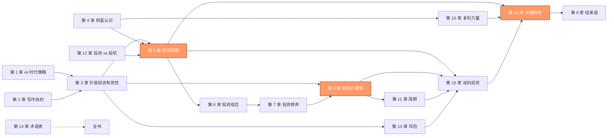
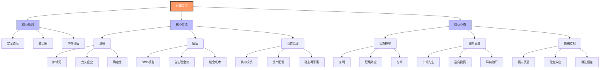
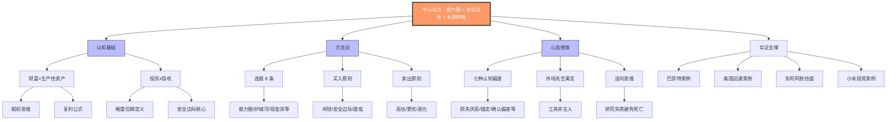

# 知识体系图谱 - 《我对价值投资的思考》

## 中心论点

> **坚守能力圈内的龙头企业，以安全边际价格买入并长期持有，是普通人实现财富自由的最优路径。**

---

## 知识体系图谱

```mermaid
graph TD
    A[中心论点：能力圈 + 安全边际 + 长期持有<br/>= 普通人财富自由最优路径]

    A --> B[认知重构]
    A --> C[风险识别]
    A --> D[市场理解]
    A --> E[复利机制]
    A --> F[选股原则]
    A --> G[估值买卖]
    A --> H[仓位管理]
    A --> I[心性修养]
    A --> J[AI 时代]
    A --> K[知行合一]

    B --> B1[财富=生产性资产]
    B --> B2[投资 vs 投机]
    B1 --> B1a[股权思维]
    B2 --> B2a[安全边际]

    C --> C1[本金永久损失=真风险]
    C --> C2[五大风险维度]
    C1 --> C1a[波动≠风险]
    C2 --> C2a[价格/行为/结构性/认知/基本面]

    D --> D1[市场周期不可测]
    D --> D2[行业周期可把握]
    D1 --> D1a[利用而非预测]
    D2 --> D2a[供需逻辑]

    E --> E1[复利公式]
    E --> E2[复利三敌]
    E1 --> E1a[本金×收益率^时间]
    E2 --> E2a[永久损失/税收/心理中断]

    F --> F1[能力圈边界]
    F --> F2[六大护城河]
    F --> F3[企业文化]
    F1 --> F1a[清楚边界比大小重要]
    F2 --> F2a[品牌/特许权/规模/网络/转换成本/专利]

    G --> G1[DCF 艺术估值]
    G --> G2[安全边际买入]
    G --> G3[三卖四不原则]
    G1 --> G1a[FCF/g/r 三变量]
    G2 --> G2a[50 美分买 1 美元]
    G3 --> G3a[高估/更优/恶化时卖]

    H --> H1[资产配置四象限]
    H --> H2[集中投资前提]
    H1 --> H1a[现金/债券/股票/不动产]
    H2 --> H2a[3-5 只不同行业重仓]

    I --> I1[七种认知偏差]
    I --> I2[市场先生定位]
    I --> I3[逆向思维训练]
    I1 --> I1a[损失厌恶/锚定/确认偏差等]
    I2 --> I2a[工具非主人]
    I3 --> I3a[研究失败避免死亡]

    J --> J1[AI 能力边界]
    J --> J2[人机协作范式]
    J1 --> J1a[人性/逆向/定力不可替代]
    J2 --> J2a[AI 处理信息人做定性]

    K --> K1[四不投四不要三要]
    K --> K2[投资=终身修行]
    K1 --> K1a[热点/重资产/相对胜出/重组]
    K2 --> K2a[独立思考/克制贪婪/复利耐心]

    style A fill:#f96,stroke:#333,stroke-width:3px,color:#fff
    style B fill:#bbf,stroke:#333
    style C fill:#bbf,stroke:#333
    style D fill:#bbf,stroke:#333
    style E fill:#bbf,stroke:#333
    style F fill:#bbf,stroke:#333
    style G fill:#bbf,stroke:#333
    style H fill:#bbf,stroke:#333
    style I fill:#bbf,stroke:#333
    style J fill:#bbf,stroke:#333
    style K fill:#bbf,stroke:#333
```

---

## 章节关联图谱

---

## 概念层级图谱

---

## 论证结构图谱

---

## 如何使用本图谱

### 1. 理解全书结构
- 从**中心论点**出发，理解十大一级论点的逻辑关系
- 通过**章节关联图谱**了解各章节的前置和后续关系

### 2. 查找特定概念
- 使用**概念层级图谱**定位概念所属类别
- 核心原则 → 核心方法 → 核心心态 三大类别

### 3. 理解论证逻辑
- **论证结构图谱**展示中心论点如何被支撑
- 认知基础 → 方法论 → 心态修炼 → 实证支撑

### 4. 写作参考
- 新章节创作时参考概念层级关系
- 确保论证逻辑的完整性

---

**生成时间**：2026-04-30
**知识库版本**：1.0.0
